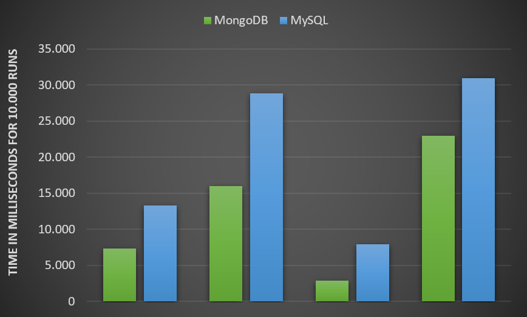

# DEA Onderzoeksverslag
Door: Jules Koster (1653865) en Suzanne Coenen (1666029)

Docent: Bart van der Wal

Klas: ITA-OOSE-A-f

Versie: 2.0

26 mei 2023

___

## Samenvatting
Dit onderzoeksverslag heeft tot doel de voor- en nadelen van het vervangen van de relationele database MySQL door de niet-relationele database MongoDB te onderzoeken. Uit de resultaten van het onderzoek is gebleken dat MongoDB verschillende voordelen biedt en een geschikt alternatief zou zijn voor MySQL in de SpotiTube-applicatie. MongoDB heeft aangetoond veel sneller te zijn dan MySQL, waardoor de prestaties minder worden beïnvloed bij het ophalen van grote hoeveelheden gegevens uit de database, waardoor gebruikers optimaal gebruik kunnen maken van SpotiTube. Andere voordelen van MongoDB zijn de schaalbaarheid en flexibiliteit, waarbij het gemakkelijk verschillende datatypen accepteert en horizontaal schaalt zonder afhankelijk te zijn van tabellen.

Een van de nadelen van MongoDB is dat het mogelijk minder accurate data kan bevatten in vergelijking met MySQL, vanwege het ontbreken van 'primary keys' en 'foreign keys' die duplicatie van informatie voorkomen.

Niettemin lijken de voordelen van MongoDB te voldoen aan de behoeften van de SpotiTube-applicatie, zoals het kunnen opslaan van grote datasets en het ophalen van gegevens uit de database zonder significante prestatieverlies. Op basis hiervan zijn er geen bezwaren tegen de implementatie van een niet-relationele database zoals MongoDB voor SpotiTube.

## Inhoudsopgave

1. [Inleiding](#1-inleiding)
   1. [Onderwerp](#11-onderwerp)
   2. [Onderzoeksvraag](#12-onderzoeksvraag)
   3. [Deelvragen](#13-deelvragen)
   4. [Onderzoeksmethoden](#14-onderzoeksmethoden)

2. [Theoretisch Kader en Literatuuronderzoek](#2-theoretisch-kader-en-literatuuronderzoek)
   1. [Wat zijn de belangrijkste verschillen tussen de verschillende en populairste soorten niet-relationele databases en welke is het meest geschikt voor de specifieke behoeften en vereisten van de applicatie?](#21-wat-zijn-de-belangrijkste-verschillen-tussen-de-verschillende-en-populairste-soorten-niet-relationele-databases-en-welke-is-het-meest-geschikt-voor-de-specifieke-behoeften-en-vereisten-van-de-applicatie)
      1. [Documentgeoriënteerde Databases](#211-documentgeoriënteerde-databases)
      2. [Key-value Databases](#212-key-value-databases)
      3. [Kolomgeoriënteerde Databases](#213-kolomgeoriënteerde-databases)
      4. [Graph Databases](#214-graph-databases)
      5. [Conclusie](#215-conclusie)

   2. [Hoe kan men vergelijkbare resultaten behalen in een niet-relationele database, zoals die verkregen worden via een join-operatie in een relationele database?](#22-hoe-kan-men-vergelijkbare-resultaten-behalen-in-een-niet-relationele-database-zoals-die-verkregen-worden-via-een-join-operatie-in-een-relationele-database)
       	1. [Join-Operaties in MongoDB](#221-join-operaties-in-mongodb)
       	2. [Join-Operaties in Redis](#222-join-operaties-in-redis)
       	3. [Join-Operaties in Apache Cassandra](#223-join-operaties-in-apache-cassandra)
       	4. [Join-Operaties in Neo4j](#224-join-operaties-in-neo4j)
3. [Wat is het verschil in snelheid tussen het ophalen van gegevens uit MongoDB vergeleken met MySQL?](#3-wat-is-het-verschil-in-snelheid-tussen-het-ophalen-van-gegevens-uit-mongodb-vergeleken-met-mysql)
4. [Werkplaatsonderzoek](#4-werkplaatsonderzoek)
5. [Discussie](#5-discussie)
6. [Conclusie](#6-conclusie)
7. [Bronnen](#7-bronnen)


## 1 Inleiding

Suzanne en ik onderzoeken de mogelijkheden van databases. We willen met name de mogelijkheid onderzoeken of het mogelijk is een traditionele relationele database te vervangen door een niet-relationele, namelijk de niet-relationele database MongoDB. Om dit te bereiken zullen we onze aandacht richten op de voordelen, nadelen en potentiële veiligheidsrisico's die zich voor kunnen doen bij de migratie van MySQL naar MongoDB.

Ons onderzoek omvat informatie vergaren door middel van de SWOT analysis methode en het maken van een prototype voor de SpotiTube-applicatie, die de huidige relationele database zal vervangen door MongoDB. Op die manier hopen we de verschillen tussen de twee databasesystemen aan te tonen, inclusief de potentiële voor- en nadelen van het gebruik van een MongoDB in plaats van de relationele database MySQL. 

Met dit onderzoek hopen we inzicht te verschaffen om de keuze of je nu wel of niet zou overstappen van MySQL naar MongoDB. Door de uitdagingen en mogelijkheden van niet-relationele databases te onderzoeken, hopen we een uitgebreid overzicht te geven van hun functionaliteit en geschiktheid voor verschillende toepassingen. 

### 1.1 Onderwerp

Het onderwerp van dit onderzoek is: “Het vervangen van een relationele relationele database door een niet relationele (NoSQL) database.” Dit onderwerp richt zich op het verkennen van de mogelijkheden en uitdagingen van het vervangen van het al bestaande relationele database door een niet relationele database. 

Het onderzoek zal zich onder andere richten op de verschillende niet-relationele databases, wat de voor- en nadelen zijn van het gebruik van niet-relationele databases en de prestatie- en schaalbaarheidsverschillen tussen de relationele database MySQL en de niet-relationele database MongoDB. Door deze aspecten te onderzoeken, kan worden gekeken of het vervangen van MySQL door MongoDB gunstig is voor de Spotitube applicatie.

### 1.2 Onderzoeksvraag

Onze hoofdvraag voor dit onderzoeksverslag luidt alsvolgt: “Wat zijn de voor- en nadelen van het vervangen van de relationele database MySQL door de niet relationele database MongoDB?”. 

Om deze vraag te beantwoorden zullen we de verschillen tussen relationele en niet-relationele databases onderzoeken, inclusief hun structuur en functionaliteit. We zullen ook onderzoeken welke soorten gegevens het meest geschikt zijn voor elk type database en de schaalbaarheid en prestaties van beide.

Om tot een uitgebreid beeld te komen, zullen we dus gebruik maken van verschillende onderzoeksmethoden. De methodes die wij zullen gebruiken binnen dit onderzoek zijn: Literature Study, SWOT Analysis, Usability Testing en Requirement Prioritization (Methods - ICT research methods, z.d.). Ook zullen we dit doen aanhand van een aantal deelvragen die we hebben opgesteld. 

Aan het eind van dit onderzoek hopen wij te beschikken over een nauwkeurig beeld van de voor- en nadelen van de vervanging van een relationele database door een niet-relationele database en hoe dit betrekking zal hebben op de SpotiTube applicatie. 

### 1.3 Deelvragen

Om tot een conclusie te komen op de hoofdvraag hebben we een viertal deelvragen bedacht om het beantwoorden van de hoofdvraag makkelijker te maken. De vier deelvragen luiden als volgt:

1.	Wat zijn de belangrijkste verschillen tussen de verschillende en populairste soorten niet-relationele databases en welke is het meest geschikt voor de specifieke behoeften en vereisten van de applicatie?

2.	Hoe kan men vergelijkbare resultaten behalen in een niet-relationele database, zoals die verkregen worden via een join-operatie in een relationele database? 

3.      Welke criteria moeten worden vervuld om MongoDB in te kunnen zetten ter vervanging van een relationele database in een applicatie?

4.	Wat is het verschil in snelheid tussen het ophalen van gegevens uit MongoDB vergeleken met MySQL? 


### 1.4 Onderzoeksmethoden

Wij maken binnen dit onderzoek gebruik van de volgende onderzoeksmethoden:

Voor de methode Library gebruiken we ‘Literature Study’ en ‘SWOT analysis’, voor de methode Lab gebruiken we ‘Non-functional test’ en als laatste voor de methode Workshop gebruiken wij ‘Requirement Prioritization’.

Deelvraag 1 wordt beantwoord door gebruik te maken van de onderzoeksmethode ‘Literature Study’. Deelvraag 2 beantwoorden we door gebruik te maken van ‘SWOT analysis’, deelvraag 3 gaan we beantwoorden door de methode ‘Requirement Prioritization’ toe te passen en als laatste wordt deelvraag 4 beantwoordt door gebruik te maken van ‘Non-functional test’. (Methods - ICT research methods, z.d.)


## 2 Theoretisch Kader en Literatuuronderzoek

### 2.1 Wat zijn de belangrijkste verschillen tussen de verschillende en populairste soorten niet-relationele databases en welke is het meest geschikt voor de specifieke behoeften en vereisten van de applicatie?

Niet-relationele databases zijn een type databasebeheersysteem dat is ontworpen om grote hoeveelheden ongestructureerde data te verwerken. In tegenstelling tot traditionele relationele databases hebben niet-relationele databases geen vast schema of tabelstructuur nodig, wat ze zeer schaalbaar en flexibel maakt (Janata et al., 2012).

Er zijn vier hoofdtypen niet-relationele databases: documentgeoriënteerd, key-value, kolomgeoriënteerd en graph databases. In dit hoofdstuk zullen we beschrijven wat elk databasetype inhoudt en wat de voor- en nadelen hiervan zijn.

#### 2.1.1 Documentgeoriënteerde Databases

Documentgeoriënteerde databases zijn een type niet-relationele database dat gegevens opslaat in documenten in plaats van tabellen, zoals relationele databases. Elk document bevat alle informatie die nodig is om een specifiek object te beschrijven, inclusief de attributen en waarden, en kan worden opgeslagen in verschillende formaten zoals JSON of BSON (Vera et al., 2015).

Een voordeel van documentgeoriënteerde databases is dat ze flexibeler zijn dan relationele databases. In plaats van een strikte structuur te hebben, kunnen documentgeoriënteerde databases werken met semi-gestructureerde gegevens, zoals JSON of XML. Hierdoor kunnen documentgeoriënteerde databases eenvoudig worden aangepast aan wijzigingen in de gegevensstructuren, waardoor ze zeer geschikt zijn voor toepassingen waarbij de structuur van de gegevens kan veranderen of onvoorspelbaar is. Naast de flexibiliteit van documentgeoriënteerde databases, bieden ze ook voordelen op het gebied van snelheid doordat grote hoeveelheden informatie tegelijkertijd kunnen worden opgehaald en verwerkt (Vera et al., 2015).

Een nadeel van documentgeoriënteerde databases is dat ze minder geschikt zijn voor het uitvoeren van complexe query's, omdat de gegevens niet onderling zijn gekoppeld en in afzonderlijke documenten zijn opgeslagen. Het kan moeilijker zijn om bepaalde gegevens op te halen dan in relationele databases (Vera et al., 2015).

In conclusie bieden documentgeoriënteerde databases een flexibele aanpak voor de opslag van semi-gestructureerde gegevens en kunnen ze gemakkelijk worden aangepast aan wijzigingen in de gegevensstructuren. Echter, ze zijn minder geschikt voor het uitvoeren van complexe query's in vergelijking met relationele databases. Bij het maken van een datamodel voor een documentgeoriënteerde database is het belangrijk om te overwegen hoe de gegevens zullen worden opgevraagd en bijgewerkt, zodat het datamodel hierop kan worden afgestemd en de prestaties van de database kunnen worden verbeterd.

#### 2.1.2  Key-value Databases

Key-value databases zijn databases die gegevens opslaan als een key-value paar, waarbij elke key een unieke identifier is voor de data en de value de daadwerkelijke data zelf (Janata, 2012). Ze zijn populair vanwege hun eenvoud, schaalbaarheid en snelheid, en worden vaak gebruikt voor toepassingen die snel en efficiënt gegevens moeten opvragen.

Een van de belangrijkste voordelen van het gebruik van key-value databases is hun gebruiksgemak. Vanwege hun eenvoudige structuur zijn ze gemakkelijk te begrijpen en te gebruiken. Bovendien staan key-value databases bekend om hun snelheid en vermogen om een hoog volume aan transacties te verwerken. Dit maakt ze een populaire keuze voor toepassingen die snel en efficiënt gegevens moeten opvragen (Baron, 2016).

Een nadeel van een key-value database is dat het minder geschikt is voor complexe queries en zoekopdrachten die niet gebaseerd zijn op specifieke keys. Omdat de data in een key-value database is georganiseerd rond de keys, kan het moeilijker zijn om gegevens te vinden die niet direct aan een specifieke key zijn gekoppeld. Dit kan het minder geschikt maken voor bepaalde soorten toepassingen waarin gegevens vaak op verschillende manieren moeten worden geanalyseerd en gerelateerd (Baron, 2016).

In conclusie bieden key-value databases een eenvoudige en efficiënte manier om grote hoeveelheden data op te slaan en op te vragen. Hoewel ze mogelijk niet geschikt zijn voor alle toepassingen, bieden ze een krachtig instrument voor bedrijven die snelle en schaalbare opslag en opvraging van gegevens nodig hebben.

#### 2.1.3 Kolomgeoriënteerde Databases

Kolomgeoriënteerde databases slaan gegevens op in kolommen in plaats van rijen, waardoor ze efficiënter zijn in het omgaan met grote hoeveelheden gegevens. In een rij-gebaseerde database worden alle gegevens voor een record opgeslagen in één rij, terwijl in een kolomgeoriënteerde database alle gegevens voor een kolom samen worden opgeslagen. Dit zorgt voor snellere verwerking en opvraging van grote datasets (Janata, 2012).

Kolomgeoriënteerde databases hebben ook een unieke compressietechniek die de opslagvereisten extreem erg kan verminderen. Ze comprimeren gegevens door kolommen te comprimeren in plaats van rijen, waardoor ze zeer efficiënt zijn in opslag en verwerking. Deze compressietechniek is vooral nuttig bij analytische verwerking, waar grote hoeveelheden gegevens snel moeten worden verwerkt (Matei & Bank, 2010).

Een ander voordeel van kolomgeoriënteerde databases is hun vermogen om spaarzame gegevens efficiënt te verwerken. Spaarzame gegevens verwijzen naar datasets waarbij veel waarden ontbreken. In een rij-gebaseerde database worden nog steeds lege ruimtes toegewezen, wat opslagruimte verspilt. In een kolomgeoriënteerde database worden echter geen lege ruimtes toegewezen, wat resulteert in efficiëntere opslag (Matei & Bank, 2010).

Een nadeel van kolomgeoriënteerde databases is dat het minder geschikt is voor het snel opvragen van volledige rijen met gegevens, omdat de gegevens per kolom worden opgeslagen en niet per rij. Als je bijvoorbeeld alle gegevens van een bepaalde persoon wilt opvragen, moet de database alle kolommen doorzoeken om de relevante gegevens op te halen. Dit kan leiden tot langere responstijden dan in een rij-geörienteerde database waar de gegevens van een rij bij elkaar staan (Matei & Bank, 2010).

In conclusie, kolomgeoriënteerde databases bieden verschillende voordelen ten opzichte van rij-geörienteerde databases, waaronder  snellere verwerking en opvraging van grote datasets, efficiënte compressietechnieken en betere verwerking van spaarzame gegevens.  Echter, een nadeel van kolom-geörienteerde databases is dat het minder geschikt is voor het snel opvragen van volledige rijen met gegevens.

#### 2.1.4 Graph Databases

Een graph-database is een speciaal type database dat gegevens opslaat in een grafische structuur, waarbij knooppunten, randen en eigenschappen worden gebruikt om gegevenspunten en hun relaties te representeren. Het knooppunt staat voor een gegevenspunt, de rand staat voor een relatie tussen twee knooppunten en eigenschappen kunnen worden toegevoegd om extra informatie te verstrekken (Janata, 2012). graph-databases zijn erg handig voor complexe gegevensrelaties, zoals in sociale netwerken, aanbevelingssystemen en kennisgrafieken.

Met graph-databases kun je gemakkelijk grote, complexe datasets behandelen, omdat de graph-structuur horizontaal kan worden geschaald naarmate de gegevens groeien. Ook zijn graph-databases intuïtiever voor gebruikers, omdat de visuele representatie van de gegevens gemakkelijker te begrijpen en te navigeren is dan traditionele tabulaire gegevens. Ten slotte zijn graph-databases bijzonder geschikt voor gegevens met meerdere, geneste relaties, omdat deze relaties als knooppunten en randen kunnen worden voorgesteld en daarmee de gegevensstructuur worden vereenvoudigd (Angles, 2018).

Een nadeel van graph-databases is dat ze minder efficiënt kunnen zijn bij het uitvoeren van eenvoudige query's en het verwerken van grote hoeveelheden gegevens in vergelijking met traditionele relationele databases. Dit komt omdat de graph-database de relaties tussen knooppunten moet doorzoeken om de gewenste informatie op te halen, wat in sommige gevallen meer tijd en middelen kan vergen dan een eenvoudige query in een traditionele relationele database (Angles, 2018).

In conclusie is een graph-database een krachtige tool voor het opslaan en beheren van complexe gegevensrelaties. Het biedt voordelen zoals schaalbaarheid en intuïtieve visualisatie van gegevens. Maar, het kan minder efficiënt zijn bij het uitvoeren van eenvoudige query's en het verwerken van grote hoeveelheden gegevens in vergelijking met traditionele relationele databases. Daarom is het belangrijk om de toepassingsvereisten te evalueren om te bepalen of een graph-database de juiste keuze is voor een specifiek project.

#### 2.1.5 Conclusie

Er zijn dus verschillende type niet-relationele databases; elk type gaat op een verschillende manier met data om. Maar, welke niet-relationele database type is de beste oplossing voor de Spotitube applicatie?
Om de deelvraag 'Wat zijn de belangrijkste verschillen tussen de verschillende en populairste soorten niet-relationele databases en welke is het meest geschikt voor de specifieke behoeften en vereisten van de applicatie?' te beantwoorden, is het belangrijk om te kijken naar de voor- en nadelen van de verschillende niet-relationele database types.

Een samenvatting van de voor- en nadelen van de verschillende niet-relationele database types:

- Documentgeoriënteerde databases:
  - Voordelen: veranderingen in gegevensstructuren zijn makkelijker aan te passen en grote datasets ophalen gaat vlotter
  - Nadelen: minder geschikt voor complexe queries
- Key-value databases:
  - Voordelen: gebruiksgemak, snelheid en schaalbaarheid.
  - Nadelen: minder geschikt voor complexe queries en zoekopdrachten die niet gebaseerd zijn op specifieke keys.
- Kolomgeoriënteerde databases:
  - Voordelen: efficiënt bij het omgaan met grote hoeveelheden gegevens en het uitvoeren van analytische queries.
  - Nadelen: minder geschikt voor transacties en het uitvoeren van operaties op individuele records.
- Graph databases:
  - Voordelen: geschikt voor het opslaan van complexe relaties en het uitvoeren van complexe queries.
  - Nadelen: minder geschikt voor transacties en minder efficiënt bij het opslaan van grote hoeveelheden data.

De Spotitube applicatie heeft behoefte aan een schaalbare database die in staat is om grote hoeveelheden data tegelijk op te halen. Belangrijk is dat de database flexibel is, zodat het gemakkelijk is om nieuwe velden toe te voegen aan de opgeslagen tracks zonder dat er veel nullable velden worden gecreëerd. Door te kiezen voor een dergelijke database kan de Spotitube applicatie snel en efficiënt werken met grote hoeveelheden data en tegelijkertijd gemakkelijk worden uitgebreid en onderhouden.

Hoewel alle niet-relationele database types hun eigen voordelen hebben, lijkt de documentgeoriënteerde database het meest geschikt voor deze specifieke toepassing. De populairste documentgeoriënteerde is MongoDB; deze is gratis en open-source, wat het een goede optie maakt voor onze applicatie.

Het voordeel van MongoDB is dat het gebruik maakt van documenten die informatie bevatten die is gerelateerd aan elkaar in één document, wat de efficiëntie en snelheid van het ophalen van grote datasets kan verbeteren. Bovendien is MongoDB flexibel en schaalbaar, waardoor het gemakkelijk kan worden aangepast aan veranderingen in gegevensstructuren en kan meegroeien met de groei van de applicatie. Daarnaast kunnen er gemakkelijk relaties tussen documenten worden gelegd door middel van MongoDB's  lookup-functionaliteit. Deze functionaliteit maakt het mogelijk om gegevens uit meerdere collecties samen te voegen en te combineren op basis van een gemeenschappelijk veld, vergelijkbaar met het uitvoeren van een join in een relationele database.

### 2.2 Hoe kan men vergelijkbare resultaten behalen in een niet-relationele database, zoals die verkregen worden via een join-operatie in een relationele database?

SQL join-operaties zijn een fundamenteel aspect van SQL waarmee gegevens uit twee of meer tabellen kunnen worden gecombineerd op basis van een gespecificeerde join-voorwaarde. De join-voorwaarde bepaalt hoe de tabellen gerelateerd zijn en welke rijen uit elke tabel worden geselecteerd (Aho et al., 1979).

Wanneer men voor het eerst een niet-relationele database gebruikt, is het vanzelfsprekend dat er enige aanpassing nodig is bij het werken met gegevens. Dus wat voor een invloed hebben deze aanpassingen op het gebruik van join-operaties, of iets vergelijkbaars? Dit is natuurlijk verschillend voor elk type niet-relationele database. We zullen de join-operaties voor de vier hoofdtypes beschreven in '[Verschillende Soorten Niet-Relationele Databases](#21-verschillende-soorten-niet-relationele-databases)' in dit hoofdstuk onderzoeken; of, om meer specifiek te zijn, de populairste database in elk type.

In dit hoofdstuk zullen we dus join-operaties, of vergelijkbare functionaliteiten, in de databases MongoDB, Redis, Apache Cassandra en Neo4j onderzoeken (Akhtar, 2023).

### 2.2.1 Join-Operaties in MongoDB

MongoDB heeft geen klassieke join-operaties zoals je ziet in relationele databases; in plaats daarvan maakt MongoDB gebruik van lookup-aggregaties om gegevens uit meerdere collecties te combineren op basis van gemeenschappelijke velden (Rithika, 2022).

In MongoDB wordt een lookup-aggregatie uitgevoerd met behulp van de  $lookup-operator, waarmee de gebruiker gegevens uit meerdere collecties kan combineren door een veld in één collectie te matchen met een veld in een andere collectie (MongoDB, z.d.). Het resultaat is een nieuwe collectie die de gecombineerde gegevens van beide collecties bevat, vergelijkbaar met het resultaat van een join-operatie in een relationele database.

Stel we hebben twee database tabellen; 'bestellingen' en 'klanten'. De 'bestellingen'-collectie bevat informatie over bestellingen van klanten, inclusief de klant-ID, terwijl de 'klanten'-collectie informatie bevat over elke klant, inclusief hun naam en adres.

De 'bestellingen'-collectie heeft dan bijvoorbeeld deze data:

```json
{
  "_id": 1,
  "klant_id": 123,
  "product_naam": "VoorbeeldProduct",
  "hoeveelheid": 2,
  "prijs": 50.0
}
```

De 'klanten'-collectie heeft dan bijvoorbeeld deze data:

```json
{
  "_id": 123,
  "naam": "Emma Jong",
  "adres": "Mauritskade 57, 1092 AD Amsterdam"
}
```

Ons doel is om de gegevens van beide collecties te combineren om een lijst te krijgen van alle bestellingen met de bijbehorende klantinformatie, zoals hun naam en adres.

Dit kunnen we doen door een $lookup-aggregatie operatie te gebruiken in MongoDB. Hier is een query als voorbeeld:

```markdown
db.bestellingen.aggregate([
  {
    $lookup:
      {
        from: "klanten",
        localField: "klant_id",
        foreignField: "_id",
        as: "klant_info"
      }
  }
])
```
(MongoDB, z.d.)

Dit zou dan het resultaat zijn van die query:

```json
{    
     "_id": 1,    
     "klant_id": 123,    
     "product_naam": "VoorbeeldProduct",    
     "hoeveelheid": 2,    
     "prijs": 50.0,    
     "klant_info": [      
         {        
             "_id": 123,        
             "naam": "Emma Jong",        
             "adres": "Mauritskade 57, 1092 AD Amsterdam"      
         }    
     ]
}
```

Dit is een voorbeeld van een MongoDB lookup-query die gegevens combineert uit twee collecties op basis van een gemeenschappelijk veld en het resultaat in een nieuwe collectie weergeeft. In dit geval worden de 'bestellingen' en 'klanten' collecties gecombineerd op basis van de 'klant_id'. Het resultaat bevat de gegevens van een bestelling met de bijbehorende klantinformatie, weergegeven als een ingesloten document met het veld 'klant_info'. Dit is vergelijkbaar met het resultaat van een join-operatie in een relationele database, maar in plaats van het samenvoegen van rijen, worden hier documenten gecombineerd.

### 2.2.2 Join-Operaties in Redis

Redis ondersteunt geen joins zoals traditionele relationele databases. Er zijn echter enkele workarounds om vergelijkbare functionaliteit te bereiken in Redis (Redis. z.d.).

Een aanpak is om de Redis datastructuur genaamd "Sorted Sets" te gebruiken samen met de opdrachten "ZINTERSTORE" en "ZUNIONSTORE" (Redis. z.d.).

Bijvoorbeeld, laten we zeggen dat we twee datasets hebben in Redis, "bestellingen" en "klanten". Elke "bestelling" is geassocieerd met een "klant" door middel van een "klant_id" veld. We kunnen een join nabootsen door voor elke dataset een gesorteerde set te maken, met het "klant_id" veld als score en het volledige object als waarde.

Voor de "bestellingen" dataset:

```sql
ZADD bestellingen 123 '{"bestelling_id": 1, "klant_id": 123, "product_naam": "VoorbeeldA", "hoeveelheid": 2, "prijs": 10}' 
```

Voor de "klanten" dataset:

```sql
ZADD klanten 123 '{"klant_id": 123, "naam": "Emma Jong", "adres": "Mauritskade 57, 1092 AD Amsterdam"}' 
```

Om een join tussen de twee datasets na te bootsen, kunnen we de "ZINTERSTORE" opdracht gebruiken om een nieuwe gesorteerde set te maken die alleen de objecten bevat waarin de "klant_id" zowel in "bestellingen" als in "klanten" voorkomt. De opdrachtsyntax is als volgt:

```sql
ZINTERSTORE output 2 bestellingen klanten WEIGHTS 1 0
```

Met behulp van Redis wordt een nieuwe gesorteerde set genaamd "output"  gecreëerd, waarin alleen objecten voorkomen waarvan het "klant_id" veld  zowel in "bestellingen" als in "klanten" aanwezig is. Door de parameter  "WEIGHTS 1 0" te gebruiken, wordt Redis geïnstrueerd om de score van de  "bestellingen" dataset als de uiteindelijke score voor de output set te  gebruiken en de score van de "klanten" dataset te negeren.

Om de inhoud van de 'output' set te kunnen zien gebruik je het volgende commando:

```sql
ZRANGE output 0 -1 WITHSCORES
```

De resulterende output set zal de volgende elementen hebben:

```sql
1. "{"bestelling_id":1,"klant_id":123,"product_naam":"VoorbeeldA","hoeveelheid":2,"prijs":10}"
2. "123"
```

Dit geeft aan dat er één order is geassocieerd met klant-ID 123. De ordergegevens zijn opgenomen als een JSON-object en de klant-ID is opgenomen als score.

Over het algemeen kan deze aanpak een manier bieden om join-achtige functionaliteit in Redis na te bootsen met behulp van gesorteerde sets en het "ZINTERSTORE" commando. Het kan echter extra verwerking vereisen aan de applicatiezijde om de resulterende output sets te verwerken (Redis. z.d.).

### 2.2.3 Join-Operaties in Apache Cassandra

In Apache Cassandra is er geen JOIN-operatie zoals in traditionele relationele databases, omdat Cassandra is ontworpen om te optimaliseren voor schrijfoperaties en horizontaal te schalen over een groot aantal knooppunten. In plaats daarvan biedt Cassandra een techniek die heet "materialized views" (OpenCredo, 2022). 

Materialized views zijn vooraf berekende tabellen die de resultaten van een query op de basistabel bevatten. Materialized views kunnen worden gemaakt om zoekopdrachten te ondersteunen die filtering op een specifieke kolom inhouden, en de materialized weergave wordt automatisch bijgewerkt als de gegevens in de basistabel veranderen (Apache Cassandra, z.d.).

Hier is een voorbeeld van het gebruik van materialized views in Apache Cassandra:

Stel we hebben de volgende twee tabellen:

```cassandra
CREATE TABLE klanten (
   id int PRIMARY KEY,
   naam text,
   adres text
);

CREATE TABLE bestellingen (
   id int PRIMARY KEY,
   klant_id int,
   product_naam text,
   prijs decimal
);
```

We willen nu een query uitvoeren waardoor we alle bestellingen van een specifieke klant kunnen opzoeken. Dit kunnen we doen met de materialized view:

```cassandra
CREATE MATERIALIZED VIEW bestellingen_by_klant AS
   SELECT klant_id, naam, adres, product_naam, prijs
   FROM bestellingen
   WHERE klant_id IS NOT NULL AND id IS NOT NULL
   PRIMARY KEY (klant_id, id);
```
(OpenCredo, 2022)

In de materialized view selecteren we de kolommen die we willen opnemen in de query, en gebruiken we de klant_id als partition key en de bestelling-id als clustering key. Dit stelt ons in staat om efficiënt te zoeken naar alle bestellingen voor een bepaalde klant (Apache Cassandra, z.d.).

Nu kunnen we de materialized view bevragen om alle bestellingen voor een specifieke klant op te halen:

```cassandra
SELECT * FROM bestellingen_by_klant WHERE klant_id = 123;
```
(Apache Cassandra, z.d.)

Dit geeft alle bestellingen weer voor klant 123, samen met de product- en prijsinformatie en het adres en de naam van de klant.

Naarmate er nieuwe bestellingen aan de bestellingen-tabel worden toegevoegd, wordt de materialized view automatisch bijgewerkt om deze wijzigingen weer te geven. Dit zorgt ervoor dat de materialized view altijd up-to-date en accuraat is (Apache Cassandra, z.d.).

### 2.2.4 Join-Operaties in Neo4j

In Neo4j kan je een join uitvoeren tussen knooppunten in een grafiek met behulp van de Cypher-querytaal. De Cypher-querytaal is de querytaal die gebruikt wordt in Neo4j om  gegevens te manipuleren en te bevragen in de grafische database. Het is  een op tekst gebaseerde taal, vergelijkbaar met SQL, die speciaal is  ontworpen voor het werken met grafen. Met Cypher kan je nodes en  relaties in een grafiek selecteren, filteren en transformeren, en  complexe query's uitvoeren om patronen en relaties in de gegevens te  ontdekken. Cypher-query's zijn leesbaar en expressief, en bieden veel  flexibiliteit en kracht bij het werken met complexe gegevensstructuren (Conacher, 2022).

Hier is een voorbeeld van hoe een join werkt in Neo4j met de "bestellingen" en "klanten" entiteiten:

Stel dat we de volgende informatie hebben:

```sql
CREATE (:Bestelling {id: 1, product_naam: "VoorbeeldA", prijs: 10, klant_id: 1});
CREATE (:Bestelling {id: 2, product_naam: "VoorbeeldB", prijs: 20, klant_id: 2});
```

```sql
CREATE (:Klant {id: 1, naam: "Emma Jong", adres: "Mauritskade 57, 1092 AD Amsterdam"});
CREATE (:Klant {id: 2, naam: "Noah Jong", adres: "Mauritskade 57, 1092 AD Amsterdam"});
```
(Conacher, 2022)

We kunnen deze twee entiteiten aan elkaar koppelen met behulp van een join query in Cypher. Een eenvoudige join query om de namen van de klanten op te halen die bestellingen hebben geplaatst, zou er als volgt uitzien (Conacher, 2022):

```sql
MATCH (o:Bestelling)-[:PLACED_BY]->(c:Klant)
RETURN c.naam, o.product_naam, o.prijs
```

Deze query maakt een match tussen de "Bestelling" en "Klant" knooppunten, die zijn verbonden met een "PLACED_BY" relatie. Vervolgens retourneert de query de naam van de klant, het product dat is besteld en de prijs van de bestelling (Conacher, 2022).

Door deze join query te gebruiken, kunnen we de gegevens uit beide entiteiten combineren en antwoorden krijgen op vragen als "welke klant heeft welke bestellingen geplaatst?" of "welke bestellingen heeft een specifieke klant geplaatst?".

### 2.3 Criteria voor het kiezen tussen relationele en niet-rationele databases in een applicatie

Er zijn meerdere criteria waar je rekening mee moet houden om uiteindelijk tot de conclusie te kunnen komen welke database je wilt gebruiken voor de applicatie. In dit hoofdstuk ga ik ze allemaal langs wat ons een goed beeld moet geven om uiteindelijk tot een conclusie te komen. 

Allereerst moeten we het hebben over de schaalbaarheid. "Niet relationele databases zijn over het algemeen ontworpen om ‘side by side’ ofwel horizontaal te schalen. Dit betekent dat een niet relationele database grotere hoeveelheden van data en verkeer aan kan zonder prestatieverlies te lijden." (MongoDB, 2023)

De volgende criteria is flexibiliteit. Een niet relationele database slaat de gegevens in een niet in een tabel vorm op maar is meer te vergelijken met een soort documenten structuur. ‘Een document kan zeer gedetailleerd zijn en tegelijkertijd een reeks verschillende soorten informatie in verschillende formaten bevatten’ (MongoDB, 2023). Dit kan handig zijn als de applicatie bijvoorbeeld te maken krijgt met ongestructureerde data of wanneer het datamodel in de loop der tijd kan veranderen.

Het laatste criteria is de performance. Doordat een relationele database veel tabellen kan hebben waar op hun plaats weer veel gegevens in zit steeds blijft groeien. Wordt de tijd die nodig is om de queries goed uit te voeren ook steeds groter. Dit probleem heb je niet bij het gebruik van een niet relationele database. Dit komt omdat een niet relationele database de gegevens als het ware naast elkaar opslaat. Hierdoor ondervind je dus niet tot nauwelijks verminderingen van performances naarmate de hoeveelheid gegevens groeit.

## 3 Wat is het verschil in snelheid tussen het ophalen van gegevens uit MongoDB vergeleken met MySQL?

Om het verschil in snelheid tussen het ophalen van gegevens uit MongoDB en MySQL te onderzoeken, hebben we een reeks snelheidstesten uitgevoerd in de Spotitube applicatie. In deze tests hebben we vier verschillende methoden getest: getAllPlaylists, getAllTracks, getTracksInPlaylistById en calculateTrackLengthInSeconds. Elke test werd 10.000 keer uitgevoerd, en we hebben de totale duur in milliseconden gemeten. We hebben de testen allemaal 3 keer uitgevoerd en de gemiddelde duur van de 3 tests genomen om de resultaten te berekenen, voor optimale accuraatheid.

De resultaten van de snelheidstesten zijn samengevat in Tabel 1, Tabel 2 en Tabel 3, waarbij elke tabel de resultaten van een reeks tests weergeeft.

| **Geteste methode** | **Snelheid van MongoDB** | **Snelheid van MySQL** | **Procent Sneller** |
| --- | --- | --- | --- |
| getAllPlaylists                 | 6.610 ms   | 12.006 ms  | MongoDB is **55%** sneller dan MySQL |
| getAllTracks                    | 16.828 ms  | 27.886 ms  | MongoDB is **60%** sneller dan MySQL |
| getTracksInPlaylistById         | 2.917 ms   | 7.722 ms   | MongoDB is **38%** sneller dan MySQL |
| calculateTrackLengthInSeconds   | 22.198 ms  | 29.486 ms  | MongoDB is **75%** sneller dan MySQL |

_Tabel 1: Resultaten van snelheidstesten_

| **Geteste methode** | **Snelheid van MongoDB** | **Snelheid van MySQL** | **Procent Sneller** |
| --- | --- | --- | --- |
| getAllPlaylists                 | 8.810 ms   | 14.675 ms  | MongoDB is **60%** sneller dan MySQL |
| getAllTracks                    | 15.835 ms  | 29.097 ms  | MongoDB is **54%** sneller dan MySQL |
| getTracksInPlaylistById         | 3.084 ms   | 8.301 ms   | MongoDB is **37%** sneller dan MySQL |
| calculateTrackLengthInSeconds   | 24.475 ms  | 34.475 ms  | MongoDB is **70%** sneller dan MySQL |

_Tabel 2: Resultaten van snelheidstesten_

| **Geteste methode** | **Snelheid van MongoDB** | **Snelheid van MySQL** | **Procent Sneller** |
| --- | --- | --- | --- |
| getAllPlaylists                 | 6.606 ms   | 13.232 ms  | MongoDB is **49%** sneller dan MySQL |
| getAllTracks                    | 15.210 ms  | 29.598 ms  | MongoDB is **51%** sneller dan MySQL |
| getTracksInPlaylistById         | 2.667 ms   | 7.811 ms   | MongoDB is **34%** sneller dan MySQL |
| calculateTrackLengthInSeconds   | 22.084 ms  | 28.896 ms  | MongoDB is **76%** sneller dan MySQL |

_Tabel 3: Resultaten van snelheidstesten_

Uit de resultaten van de snelheidstesten blijkt dat MongoDB in alle gevallen sneller is dan MySQL. De snelheidswinst varieert van 34% tot 76%, met een gemiddelde snelheidswinst van 55%. Dit betekent dat MongoDB gemiddeld 55% sneller is dan MySQL bij het ophalen van gegevens uit de Spotitube applicatie.

De resultaten van de snelheidstesten zijn samengevat in Tabel 4, waarbij het gemiddelde percentage sneller van MongoDB ten opzichte van MySQL is berekend. Dit is visueel weergegeven in Figuur 1.

| **Geteste methode** | **Gemiddelde snelheid MongoDB** | **Gemiddelde snelheid MySQL** | **Gemiddeld percentage sneller** |
| --- | --- | --- | --- |
| getAllPlaylists                 | 7.342 ms   | 13.304 ms  | MongoDB is gemiddeld **55%** sneller dan MySQL |
| getAllTracks                    | 15.957 ms  | 28.860 ms  | MongoDB is gemiddeld **55%** sneller dan MySQL |
| getTracksInPlaylistById         | 2.889 ms   | 7.944 ms   | MongoDB is gemiddeld **36%** sneller dan MySQL |
| calculateTrackLengthInSeconds   | 22.919 ms  | 30.952 ms  | MongoDB is gemiddeld **74%** sneller dan MySQL |

_Tabel 4: Gemiddelde snelheidswinst van MongoDB ten opzichte van MySQL_

[](./images/speed_mongodb_vs_mysql.png)
_Figuur 1: Gemiddelde snelheidswinst van MongoDB ten opzichte van MySQL grafiek_

Om de testen uit te voeren, vullen we zowel de MySQL-database als de MongoDB-database met dezelfde 500 playlists en 500 tracks. Vervolgens vullen we beide databases met 500 relaties tussen de playlists en tracks; Deze data staat in JSON bestanden, waarvan de MySQL-database en de MongoDB-database allebei gebruik van maken. Voor het testen wordt alle data uit de database verwijderd en wordt de data opnieuw ingevoerd, zodat de data altijd hetzelfde zal zijn voor het uitvoeren van de testen. Om de testen uit te voeren gebruiken we select queries voor MySQL en find queries voor MongoDB, aangezien dit de meest gebruikte queries zijn in de Spotitube applicatie.

De testen worden uitgevoerd op een lokale machine met de specificaties die in Tabel 5 worden weergegeven. Allebei de databases zijn geïnstalleerd op dezelfde machine, zodat de testen onder dezelfde omstandigheden worden uitgevoerd.

| **Specificatie** | **Waarde** |
| --- | --- |
| Besturingssysteem | Windows 11 Home 22H2 |
| Processor | Intel(R) Core(TM) i7-10870H CPU @ 2.20GHz 2.21 GHz |
| RAM | 32,0 GB (31,9 GB bruikbaar) |
| Systeemtype | 64-bits besturingssysteem, x64-gebaseerde processor |

_Tabel 5: Specificaties van de machine waarop de testen zijn uitgevoerd_

Hieronder volgt een codefragment waarin een van de methoden wordt gedemonstreerd die we hebben gebruikt om de snelheid van de verschillende databases te testen:
```Java
public void testGetAllPlaylists() {
        long[] mysqlDurations = new long[ITERATIONS];
        long[] mongoDurations = new long[ITERATIONS];
        for (int i = 0; i < mysqlDurations.length; i++) {
            mysqlDurations[i] = MySQLExecutions.getAllPlaylists(connection);
        }
        for (int i = 0; i < mongoDurations.length; i++) {
            mongoDurations[i] = MongoDBExecutions.getAllPlaylists(database);
        }
        long mysqlDuration = calculateAverage(mysqlDurations);
        long mongoDuration = calculateAverage(mongoDurations);
        long mysqlTotal = calculateTotal(mysqlDurations);
        long mongoTotal = calculateTotal(mongoDurations);
        long percentage = calculatePercentage(mongoTotal, mysqlTotal);

        printResults("getAllPlaylists", mongoDuration, mysqlDuration, mongoTotal, mysqlTotal, percentage);
    }
```
In de methode 'testGetAllPlaylists' initialiseren we eerst twee arrays van het type 'long' waarin de totale tijd voor het uitvoeren van de query's wordt opgeslagen. Vervolgens halen we voor elke iteratie de benodigde tijd op en slaan deze op in de respectievelijke arrays. Uiteindelijk berekenen we het gemiddelde en de totale tijd van alle query's en geven deze weer in de consolelog.

In conclusie is MongoDB gemiddeld 55% sneller dan MySQL bij het ophalen van gegevens uit de Spotitube applicatie. Dit betekent dat MongoDB een goede vervanger is voor MySQL in de Spotitube applicatie, aangezien MongoDB sneller is dan MySQL en de Spotitube applicatie hierdoor sneller zal werken.

Als we deze resultaten vergelijken met Čerešňák en Kvet (2019), is het verschil tussen MongoDB en MySQL aanzienlijk groter. In hun onderzoek duurt een MySQL select query gemiddeld 0.067ms, terwijl een MongoDB find query gemiddeld 0.009ms duurt. In dat onderzoek is MongoDB dus gemiddeld 13,4% sneller dan MySQL, terwijl MongoDB in ons onderzoek gemiddeld 55% sneller is dan MySQL. Dit verschil zou kunnen worden verklaard door het feit dat Čerešňák en Kvet (2019) een veel grotere dataset hebben gebruikt dan wij. Zij hebben een dataset van 100.000 documenten gebruikt, terwijl wij een dataset van 500 documenten hebben gebruikt. 

Hoewel dit een groot verschil is, kan er nog steeds geconcludeerd worden dat MongoDB sneller is dan MySQL bij het ophalen van gegevens met een select- of find-query. Om de deelvraag 'Wat is het verschil in snelheid tussen het ophalen van gegevens uit MongoDB vergeleken met MySQL?' te beantwoorden, kunnen we dus concluderen dat MongoDB gemiddeld 55% sneller is dan MySQL bij het ophalen van gegevens uit de Spotitube applicatie.

## 4 Werkplaatsonderzoek 

Het implementeren van MongoDB in plaats van MySQL in de Spotitube applicatie ging erg gemakkelijk doordat in de Spotitube applicatie het Separated Interface Pattern en het DAO-pattern zijn gebruikt. Hierdoor hoefde alleen de database queries en de data mapper patterns aangepast te worden.

Hier is bijvoorbeeld de implementatie van het ophalen van alle playlists in MySQL:

```java
@Override
public PlaylistCollectionDTO read() throws DataAccessException {
    try {
        DbConnection dbConnection = new DbConnection();
        Connection connection = dbConnection.getConnection();
        PreparedStatement playlistTableStatement = connection.prepareStatement("SELECT * FROM playlists");
        ResultSet resultSet = playlistTableStatement.executeUpdate();
        return ResultSetMapper.mapToPlaylistDTOCollection(resultSet);
    } catch (Exception e) {
        throw new DataAccessException(e.getMessage());
    }
}
```

Dit is dezelfde methode, maar dan met een MongoDB database:

```java
@Override
public PlaylistCollectionDTO read() throws DataAccessException {
    try {
        MongoDatabase database = MongoDbConnection.getDatabase();
        MongoCollection<Document> playlistCollection = database.getCollection("playlists");
        List<Document> playlists = new ArrayList<>();
        playlistCollection.find(new Document()).iterator().forEachRemaining(playlists::add);
        return DocumentMapper.documentListToPlaylistCollectionDTO(playlists);
    } catch (Exception e) {
        throw new DataAccessException(e.getMessage());
    }
}
```

Zoals je ziet, was deze verandering bijzonder makkelijk te maken. 

Bij de MySQL implementatie van de applicatie hadden we verschillende tabellen;

- Users
- Playlists
- Tracks
- Track_playlist_relations
- User_playlist_relations

de 'relations' tabellen bevatten foreign keys die bijvoorbeeld aangeven welke tracks er bij welke playlists horen. In MongoDB doen we dit anders.

In MongoDB hebben we simpelweg 3 collecties:

- Users
- Playlists
- Tracks

De playlists waar een track in zit worden bijvoorbeeld opgeslagen in de track zelf; er is hier een extra veld toegevoegd, playlists:

```json
[
	{
		"playlistId": 1,
		"offlineAvailable": true,
	},
	{
		"playlistId": 2,
		"offlineAvailable": false,
	}
]
```

Aangezien dit nu wordt opgeslagen in de track zelf, kan dit veel sneller opgehaald in tegenstelling tot de MySQL functie, die eerst een JOIN-operatie moet uitvoeren.

We zijn ongeveer 3 uur bezig geweest met het omzetten van de MySQL database naar de MongoDB database; een hele korte tijd, dus. MongoDB kon extreem makkelijk geïmplementeerd te worden en we hadden minder problemen dan bij het implementeren van MySQL. MongoDB is dus, naar onze mening, een betere database om te gebruiken voor de Spotitube applicatie. 

## 5 Discussie

Tijdens het beantwoorden van de onderzoeksvragen kwamen wij er achter dat onze hoofdvraag iets te breed was voor dit onderzoek. Na uitgebreid onderzoek naar de voor- en nadelen van het vervangen van de relationele database MySQL door de niet-relationele database MongoDB voor de SpotiTube-applicatie, kunnen we concluderen dat het gebruik van MongoDB aanzienlijke voordelen biedt en een geschikt alternatief zou zijn voor MySQL. Hierop besloten wij onze hoofdvraag aan te passen en het onderzoek te richten op de niet relationele MongoDB i.p.v. alle andere niet relationele databases.

Een van de belangrijkste voordelen die uit ons onderzoek naar voren kwam, is dat MongoDB aanzienlijk sneller presteert dan MySQL. Deze verbeterde snelheid is vooral merkbaar bij het ophalen van grote hoeveelheden data uit de database. Door de snelle respons van MongoDB kan de gebruiker van SpotiTube optimaal gebruik maken van de applicatie, zonder dat de prestaties merkbaar lijden onder het verwerken van omvangrijke datasets.

Daarnaast biedt MongoDB aanzienlijke schaalbaarheids- en flexibiliteitsvoordelen. Het is zeer flexibel bij het accepteren van verschillende datatypen, waardoor het gemakkelijker wordt om gevarieerde informatie in de database op te slaan. Bovendien kan MongoDB horizontaal schalen, wat betekent dat het eenvoudig kan worden uitgebreid zonder afhankelijk te zijn van tabellen. Dit maakt het gemakkelijker om de database aan te passen aan toekomstige groei en veranderingen in de SpotiTube-applicatie.

Hoewel er enkele nadelen zijn verbonden aan het gebruik van MongoDB, zoals het potentieel bevatten van minder accurate data in vergelijking met MySQL, zijn wij van mening dat de voordelen zwaarder wegen dan deze mogelijke nadelen. De behoeften van de SpotiTube-applicatie, zoals het efficiënt opslaan van grote datasets en het probleemloos ophalen van gegevens uit de database, worden goed vervuld door MongoDB.

## 6 Conclusie

Terugkomend op wat we besproken hebben in de discussie raden we aan, op basis van onze bevindingen, om over te stappen op een niet-relationele database zoals, in het geval van dit onderzoek, MongoDB voor de SpotiTube-applicatie. De voordelen op het gebied van prestaties, schaalbaarheid en flexibiliteit wegen zwaarder dan de mogelijke nadelen. Hierdoor kan SpotiTube profiteren van verbeterde functionaliteit en efficiëntie in gegevensverwerking, wat uiteindelijk zou kunnen leiden tot een positieve impact op de gebruikerservaring.

## 7 Bronnen

- Aho, A. V., Beeri, C., & Ullman, J. D. (1979). The theory of joins in relational databases. *ACM Transactions on Database Systems (TODS)*, *4*(3), 297-314.

- Angles, R. (2018, May). The Property Graph Database Model. In *AMW*.

- Akhtar, A. (2023). Popularity Ranking of Database Management Systems. *arXiv preprint arXiv:2301.00847*.

- Baron, C. A. (2016). NoSQL key-value DBs riak and redis. *Database Systems Journal*, *6*(4), 3-10.

- Čerešňák, R., & Kvet, M. (2019). Comparison of query performance in relational a non-relation databases. Transportation research procedia, 40, 170–177. https://doi.org/10.1016/j.trpro.2019.07.027

- Janata, N., Puri, S., Ahuja, M., Kathuria, I., & Gosain, D. (2012). A survey and comparison of relational and non-relational database. *International Journal of Engineering Research & Technology*, *1*(6), 1-5.

- Matei, G., & Bank, R. C. (2010). Column-oriented databases, an alternative for analytical environment. *Database Systems Journal*, *1*(2), 3-16.

- MongoDB. (2023, Januari 1). What Is a Non-Relational Database? Opgeroepen op Maart 31, 2023, van MongoDB.

- MongoDB. (z.d.). $lookup (aggregation) — MongoDB Manual. https://www.mongodb.com/docs/manual/reference/operator/aggregation/lookup/

- OpenCredo. (2022, 15 juni). Everything you need to know about Cassandra Materialized Views - OpenCredo. https://opencredo.com/blogs/everything-need-know-cassandra-materialized-views/

- Redis. (z.d.). *Redis*. https://redis.io/

- Rithika, S. (2022, 29 december). Understanding MongoDB Joins | 5 Critical Aspects. *Learn | Hevo*. https://hevodata.com/learn/mongodb-joins/

- Vera, H., Boaventura, W., Holanda, M., Guimaraes, V., & Hondo, F.  (2015, September). Data modeling for NoSQL document-oriented databases. In *CEUR Workshop Proceedings* (Vol. 1478, pp. 129-135).

- Conacher, A. (2022, maart 9). You Want Some Join Context? Neo4j Has You Covered. *Neo4j Graph Data Platform*. https://neo4j.com/blog/join-context-neo4j/

- Apache Cassandra | Apache Cassandra Documentation. (z.d.). *Apache Cassandra*. https://cassandra.apache.org/

- ICT Research Methods. (2022, Juni 10). *Methods*. Opgeroepen op Maart 31, 2023, van ictresearchmethods: https://ictresearchmethods.nl/Methods

- OnderwijsOnline (z.d.-b). https://han.onderwijsonline.nl/
