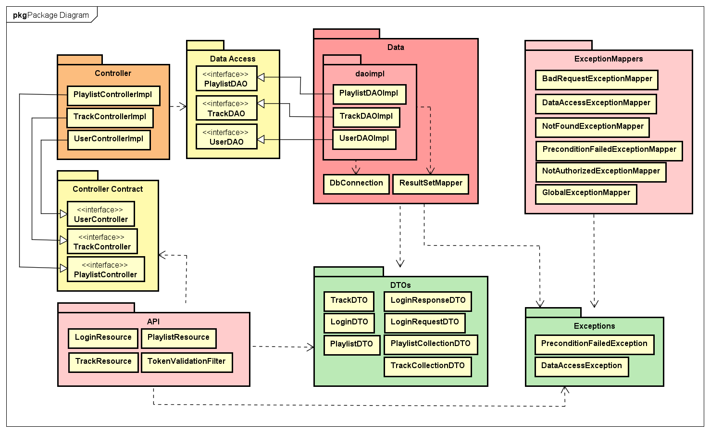

# Spotitube 

  

Deze repository bevat de code voor de Spotitube applicatie, die gemaakt is voor de opdracht van het vak OOSE DEA.

| Student        | Studentnummer | Klas         | Docent           |
|----------------|---------------|--------------|------------------|
| Suzanne Coenen | 1666029       | ITA-OOSE-A-f | Bart van der Wal |

Inleverdatum: `2023-3-24`

---

## Inhoudsopgave
1. [Inleiding](#1-inleiding)
2. [Package Diagram](#2-package-diagram)
    1. [Separated Interface Pattern (SIP)](#21-separated-interface-pattern--sip-)
        1. [Data Access Object Pattern (DAO)](#211-data-access-object-pattern--dao-)
        2. [Service Layer Pattern (SLP)](#212-service-layer-pattern--slp-)
    2. [Data Mapper Pattern (DMP)](#22-data-mapper-pattern--dmp-)
    3. [Data Transfer Object Pattern (DTO)](#23-data-transfer-object-pattern--dto-)
3. [Deployment Diagram](#3-deployment-diagram)
    1. [Database](#31-database)
        1. [Database Tabellen](#311-database-tabellen)
    2. [JakartaEE Container en Wildfly](#32-jakartaee-container-en-wildfly)
4. [Ontwerpkeuzes](#4-ontwerp-craftsmanship--keuzes)
    1. [Lagenstructuur](#41-lagenstructuur)
       1. [API-laag](#411-api-laag)
       2. [Controller-laag](#412-controller-laag)
       3. [Data laag](#413-data-laag)
       4. [Weggelaten lagen](#414-weggelaten-lagen)
    2. [Exception Mappers](#42-exception-mappers)
    3. [Dependency Injection](#43-dependency-injection)
    4. [Comments](#44-comments)
    5. [Taal](#45-taal)
5. [Conclusie](#5-conclusie)
6. [Bronnen](#6-bronnen)

## 1 Inleiding
Dit is de back-end code voor de Spotitube applicatie, geschreven in Java met JAX-RS.
Het is een RESTful API die gebruikt kan worden om data op te halen en te bewerken in de Spotitube applicatie.
Het maakt gebruik van een MySQL database om de data op te slaan.

## 2 Package Diagram

In figuur 1 is het ontwerp van de Spotitube applicatie weergegeven.
De packages zijn niet compleet opgedeeld zoals de folderstructuur eruit ziet, maar het zit in de buurt.

Linksonderin zie je de 'API' package. Deze is verantwoordelijk voor het verwerken van de requests en het genereren van de responses.
De klassen in de API-package implementeren de interfaces in 'Controller Contract'.
Deze interfaces zijn geïmplementeerd door de klassen in de 'Controller' package.
De klassen in de 'Controller' package gebruiken de interfaces in de 'Data Access' package, die
vervolgens weer geïmplementeerd worden door de klassen in de 'Data' package.
De klassen in de 'Data' package halen de data op uit de database met behulp van de 'DbConnection' klasse.
De data die uit de database wordt gehaald wordt omgezet naar DTO's in de ResultSetMapper klasse.

Al deze klassen maken gebruik van de DTO's (Data Transfer Objects) in de 'DTO' package.
Het nut van deze DTO's is om data in specifieke formaten te kunnen uitwisselen tussen de verschillende lagen.

Verder zijn er nog de 'Exceptions' en 'ExceptionMappers' packages.
In de 'Exceptions' package staan alle custom exceptions die gebruikt worden in de applicatie.
Deze exceptions, onder andere, worden opgevangen door de 'ExceptionMappers' package, die de juiste response teruggeeft aan de client.

---

*Figuur 1 - Package Diagram*

---

In het package diagram is te zien dat de applicatie gebruik maakt van verschillende design patterns. Deze patterns zijn gebruikt om de applicatie modulair en flexibel te houden.
De volgende design patterns zijn gebruikt:
- Separated Interface Pattern (SIP)
  - Data Access Object Pattern (DAO)
  - Service Layer Pattern (SLP)
- Data Mapper Pattern (DMP)
- Data Transfer Object Pattern (DTO)
- Exception Mapper Pattern (EMP)

Dit raakt meerdere requirements van de opdracht, namelijk:
- [x] Correcte foutafhandeling op basis van JakartaEE
- [x] Data Mapper Pattern en Separated Interface, geïmplementeerd met JDBC
- [x] Correcte JSON, op basis van Data Transfer Objects

Wat minder duidelijk is in het package diagram is dat de applicatie, voor de API, gebruik maakt
van een RESTful JAX-RS API. Ook wordt er gebruik gemaakt van dependency injection met CDI in de
API laag en de Controller laag.

De volgende requirements worden dus ook geraakt:
- [x] Correcte API, geïmplementeerd met JAX-RS
- [x] Dependency Injection, geïmplementeerd met CDI

### 2.1 Separated Interface Pattern (SIP)
Het Separated Interface Pattern (SIP) is een ontwerppatroon dat wordt gebruikt om de verantwoordelijkheden van de verschillende lagen strikt gescheiden te houden.
Dit zorgt voor een hoge mate van modulariteit en flexibiliteit, waardoor veranderingen in de ene laag geen ongewenste effecten hebben op andere lagen.

Het SIP is op meerdere plekken in de applicatie toegepast; in de 'Controller Contract' package en de 'Data Access' package.
Deze maken weer gebruik van hun eigen design patterns, namelijk het Data Access Object Pattern (DAO) en het Service Layer Pattern (SLP).

#### 2.1.1 Data Access Object Pattern (DAO)
Het Data Access Object Pattern (DAO) is een ontwerppatroon dat wordt gebruikt om de toegang tot de database te regelen.
Het doel van dit patroon is om de toegang tot de database te scheiden van de rest van de applicatie.
Dit zorgt ervoor dat de applicatie onafhankelijk blijft van de database die wordt gebruikt, wat het mogelijk maakt om gemakkelijk van database te wisselen zonder dat dit gevolgen heeft voor de rest van de applicatie.

De implementatie hiervan in de applicatie is te zien in het package-diagram;
De klassen in de 'Data Access' package zijn interfaces die verschillende CRUD-operaties definiëren.
Deze interfaces worden geïmplementeerd door de klassen in de 'Data' package, of meer specifiek de 'DAOImpl' klassen.
Deze klassen zijn verantwoordelijk voor het uitvoeren van de CRUD-operaties op de database.

Een alternatief voor het DAO pattern is het gebruik van inline SQL-query's in de controller layer om rechtstreeks met de database te communiceren.
Dit is een veel simpelere oplossing, omdat er geen extra interface en/of implementie klasse voor nodig is.
Het grote nadeel van deze oplossing is dat er dan geen duidelijke scheiding is tussen de code die de database aanroept en de rest van de applicatie.

Het DAO pattern is dus een betere oplossing, omdat het de code modulair en flexibel houdt. 
Ook zorgt het DAO pattern ervoor dat er op een simpele manier van database gewisseld kan worden. Ook kunnen er
gemakkelijk meerdere databases gebruikt worden, omdat de applicatie niet afhankelijk is van de database.

#### 2.1.2 Service Layer Pattern (SLP)
Het Service Layer Pattern (SLP) is een ontwerppatroon dat gebruikt wordt om de business logica van een applicatie te scheiden van de API laag en de datalaag.
In het package-diagram zijn de interfaces voor het SLP te zien in de 'Controller Contract' package.
De implementatie hiervan is te zien in de 'Controller' package.

De controllers maken gebruik van de DTO's in de 'DTO' package, om data uit te wisselen tussen de verschillende lagen.

Een alternatief voor het SLP is het Active Record Pattern (ARP).
ARP combineert de functionaliteit van het DAO pattern en het SLP;
De klasse kan zowel de data uit de database ophalen als de business logica uitvoeren.
Dit doet het door de data access en de DTO's in de klasse zelf te implementeren.
Een groot voordeel van dit patroon is dat de implementatie eenvoudig blijft, zodat het makkelijker te begrijpen is.
Het nadeel is dat het kan leiden tot strakke koppeling tussen de objecten en de database, waardoor
code testen moeilijker wordt en het kan leiden tot meer complexiteit wanneer de applicatie groter wordt.

### 2.2 Data Mapper Pattern (DMP)
Het Data Mapper Pattern (DMP) is een ontwerppatroon dat wordt gebruikt om data uit de database om te zetten naar DTO's.
Deze is te zien in het package-diagram in de 'ResultSetMapper' klasse.
Deze klasse is in de data laag geplaatst, omdat het omzetten van data uit de database naar DTO's een taak is die alleen de data laag hoeft te kennen.

### 2.3 Data Transfer Object Pattern (DTO)
Het Data Transfer Object Pattern (DTO) is een ontwerppatroon dat wordt gebruikt om data uit te wisselen tussen verschillende lagen.
De DTO's in de applicatie zijn te vinden in de 'DTO' package, in cross cutting concerns.
Dit is omdat de DTO's gebruikt worden door bijna alle lagen in de applicatie.

Een alternatief voor het DTO pattern is het gebruik van de Entity klasse.
De Entity klasse is een klasse die het domeinmodel van de applicatie representeert. 
Het wordt vaak gebruikt om gegevens uit een database te halen en te bewerken. 
In tegenstelling tot het DTO-pattern heeft de Entity klasse meestal wel business logica in de vorm van methoden die operaties op de gegevens uitvoeren.

Een nadeel van het gebruik van de Entity klasse is dat het soms te veel verantwoordelijkheden heeft. Het kan bijvoorbeeld verantwoordelijk 
zijn voor het ophalen en bewerken van gegevens uit de database, het uitvoeren van validaties, en het uitvoeren van berekeningen. 
Dit kan leiden tot een onoverzichtelijke en moeilijk te onderhouden klasse.

### 2.4 Exception Mapper Pattern (EMP)
Het Exception Mapper Pattern (EMP) is een ontwerppatroon dat wordt gebruikt om exceptions te mappen naar HTTP status codes.
Deze is te zien in het package-diagram in de 'ExceptionMapper' package.
De exception mapper is een aparte component die de exceptions van de applicatie opvangt om ze vervolgens
om te zetten naar een format dat bruikbaar is voor de client, in dit geval HTTP status codes.

Een alternatief voor het EMP is het gebruik van try-catch blokken in code, en hierin de exception af te handelen.
Hoewel dit een eenvoudigere oplossing is voor kleine applicaties, is dit niet zo voor grotere applicaties.
Dat komt doordat er hierdoor veel code duplicatie ontstaat, en het moeilijker wordt om de code te onderhouden.

## 3 Deployment Diagram

In figuur 2 is het deployment diagram te zien van de applicatie.
De applicatie bestaat uit meerdere delen; een front-end, een back-end en een database.

De front-end is een Angular applicatie die de gebruiker een interface biedt om de applicatie te gebruiken.
Het draait op een Linux 2.6.32 apparaat en is bereikbaar via een webbrowser via het HTTPS protocol.

De back-end is een Java applicatie die de API aanbiedt voor de front-end.
Deze draait op een Windows 11 apparaat en is bereikbaar via het HTTPS protocol.
De back-end maakt gebruik van een JakartaEE container met
Wildfly 27.0.1 als applicatie server.

De database is een MySQL database die de data van de applicatie opslaat.
Deze draait op een Linux 5.4.0 apparaat en wordt bereikt vanaf de back-end via JDBC.

---

*Figuur 2 - Deployment Diagram*

---

De volgende requirements zijn hiermee opgelost:
- [x] De applicatie moet gebruik maken van de JDBC API
- [x] De applicatie moet gebruik maken van een configuratiebestand
- [x] De applicatie moet gebruik maken van een JakartaEE of JavaEE container

### 3.1 Database
De applicatie maakt gebruik van een enkele MySQL database.
De back-end applicatie maakt gebruik van JDBC om verbinding te maken met de database.

Er wordt een MySQL database gebruikt om enkele redenen:
- Het is een gratis, open source database management systeem.
- Het is een relatiedatabase, waardoor het makkelijk is om relaties tussen objecten op te slaan.
- Er is veel documentatie beschikbaar over het gebruik van MySQL.

Er zijn natuurlijk ook alternatieven voor MySQL, zoals MariaDB, PostgreSQL en Oracle.
De grootste reden om niet voor een van deze alternatieven te kiezen is dat MySQL gratis is en
de developer er al ervaring mee heeft, waardoor het makkelijker is om de applicatie te ontwikkelen.

In de toekomst zou de applicatie ook kunnen overstappen op een NoSQL database, zoals MongoDB.
Dit zou een goede keuze zijn aangezien deze schema-less is; zo is het gemakkelijker om twee soorten
tracks op te slaan in de database, zonder dat je overal een nullable veld moet toevoegen.

#### 3.1.1 Database Tabellen

Er zijn enkele tabellen in de database:
- Users
- Playlists
- Tracks
- Playlist_track_relations
- User_playlist_relations

In het user tabel staan de gebruikers van de applicatie; de gebruikersnaam, wachtwoord en token.
Aangezien er geen registratiefunctionaliteit aanwezig is, is het wachtwoord in plain text opgeslagen.

In het playlists tabel staan de playlists van de applicatie; deze bevat alleen een id en een naam.
De eigenaar van de playlist wordt opgeslagen in de user_playlist_relations tabel;
deze bevat de id van de playlist en de gebruikersnaam van de eigenaar.

In het tracks tabel staan de tracks van de applicatie, die alle informatie bevatten over een track.
Niet alle informatie hoeft gevuld te zijn, omdat de applicatie verschillende soorten tracks op kan slaan.
Alle optionele waardes zijn nullable.

In het playlist_track_relations tabel staan de tracks die in een playlist staan.
Deze bevat de id van de playlist en de id van de track. Ook bevat dit of de track offline beschikbaar is.

### 3.2 JakartaEE Container en Wildfly
De applicatie maakt gebruik van een JakartaEE container om de applicatie te draaien.
De rede dat dit gebruikt is in plaats van een JavaEE container is omdat JavaEE niet meer ondersteund wordt.
Ook is JakartaEE een gratis, open-source project wat gebaseerd is op JavaEE.

De JakartaEE container die gebruikt is is Wildfly 27.0.1.
De Wildfly versie 27.0.1 is gekozen aangezien deze JakartaEE 9.1.0 ondersteund.

Een alternatief voor Wildfly zou Apache Tomcat kunnen zijn.
De rede dat Wildfly is gekozen is omdat Wildfly meer support biedt voor JakartaEE dan Tomcat.
Dit betekent dat Wildfly meer functionaliteit biedt dan Tomcat, waardoor het makkelijker is om de applicatie te ontwikkelen.

## 4 Ontwerp-/Craftsmanship -keuzes
### 4.1 Lagenstructuur
Figuur 3 is een diagram dat de structuur van de applicatie, naar mijn mening, beter laat zien.
Het is een diagram dat ik zelf bedacht heb.

---

*Figuur 3 - Structuur Diagram*

---

De applicatie bestaat uit 3 lagen:
- De API-laag
- De Controller-laag
- De Service-laag

Deze lagenstructuur zorgt ervoor dat de applicatie een lage koppeling heeft en een hoge cohesie;
hierdoor is de applicatie makkelijk te onderhouden en te testen.

#### 4.1.1 API-laag
De API-laag is de laag die de API aanbiedt voor de front-end. Deze laag bevat de RESTful JAX-RS API.
De endpoints zitten in de resource klassen. Voordat de endpoints in PlaylistResource en TrackResource worden aangeroepen,
wordt de filterklasse aangeroepen. Deze klasse controleert of de gebruiker een valide token heeft.
In de endpoints zelf zit bijna geen logica, maar wel wat. Dit is een riskante keuze, aangezien er in
de opdrachtbeschrijving stond dat we een 'remote facade' moesten gebruiken. Aangezien dit niet in het beoordelingsmodel stond,
heb ik ervoor gekozen om wat logica in de endpoints te houden. Dit is voornamelijk omdat ik alles wat
leiden tot een response in de endpoints wil houden. Dit maakt het makkelijker om de endpoints te testen, naar mijn mening.
Op deze manier zitten alle geplande status codes op een plek, zodat het overzichtelijker is.

#### 4.1.2 Controller-laag
De controller laag heeft een set interfaces. De API-laag roept de methoden van deze interfaces aan.
De implementaties van deze interfaces hebben als bedoeling om de business logica te implementeren.

De grootste reden om een controller laag te gebruiken in deze applicatie is omdat sommige endpoints informatie
uit meerdere tabellen in de database moeten halen en dus verschillende DAO's. 
De logica in de controller laag had in dit geval makkelijk in de data laag zelf kunnen zitten, maar dat zou zorgen
voor een te sterke koppeling tussen de verschillende DAO-implementaties, waardoor er sneller bugs zouden kunnen ontstaan
en het moeilijker is om de applicatie uit te breiden.

De controller laag roept de methoden van de interfaces in de data laag aan.
De data laag implementaties hebben als bedoeling om de data uit de database te halen en te bewerken.

#### 4.1.3 Data laag
De data laag heeft een set interfaces. De controller laag roept de methoden van deze interfaces aan.
De implementaties van deze interfaces hebben als bedoeling om de data uit de database te halen en te bewerken.
Met behulp van de klasse DbConnection wordt er een verbinding met de MySQL database gemaakt;
de DbConnection klasse haalt de database gegevens uit de properties file.

Wanneer er een query is uitgevoerd om data op te halen, wordt de benodigde data in sommige gevallen eerst
naar een DTO gemapt. Dit wordt gedaan met behulp van de klasse ResultSetMapper.
De ResultSetMapper bevat de functionaliteit om een ResultSet om te zetten naar een DTO.
Er is voor gekozen om geen interface te gebruiken voor de ResultSetMapper, omdat deze klasse
ResultSet als parameters heeft. Deze klasse is dus niet generiek genoeg om een interface voor te maken.
Een oplossing hiervoor zou kunnen zijn om de data eerst om te zetten naar een List of Map, maar dat voegt
onnodige complexiteit toe aan de applicatie.

#### 4.1.4 Weggelaten lagen
De DTO's zijn niet te zien in het diagram zodat de algemene structuur van de applicatie beter zichtbaar is.
De DTO's worden namelijk gebruikt door de hele applicatie en zitten dus in een aparte map; cross cutting concerns.
Ook exceptions zitten in deze map. 

Verder zijn de exception mappers niet zichtbaar in het diagram, maar in de folderstructuur bevinden deze zich in de API-laag.
Deze mappers zorgen ervoor dat de exceptions die worden gegooid in de applicatie worden omgezet naar een response.

### 4.2 Exception mappers
De applicatie maakt gebruik van exception mappers om de exceptions die worden gegooid in de applicatie om te zetten naar een response.
Deze mappers bevinden zich in de API-laag. De reden dat de mappers in de API-laag zitten is omdat de mappers voornamelijk
worden gebruikt door de endpoints, die zich in de API-laag bevinden. De mappers zorgen ervoor dat de endpoints 
een response terugkrijgen, ook als er een exception wordt gegooid.

Deze keuze is gemaakt om code duplicatie te voorkomen en om de code overzichtelijker te maken.
De mappers zorgen ervoor dat de endpoints niet allemaal een try-catch blok hoeven te hebben om de exceptions te catchen.

### 4.3 Dependency injection
De applicatie maakt gebruik van dependency injection. De reden dat de applicatie gebruik maakt van dependency injection is
om de koppeling tussen de verschillende lagen te verminderen. De applicatie maakt gebruik van de CDI standaard van Java EE.
De CDI standaard zorgt ervoor dat de applicatie makkelijk te testen is, omdat de applicatie niet afhankelijk is van de
implementatie van de interfaces. De applicatie maakt gebruik van de @Inject annotatie om de dependencies te injecteren.
Ook was dit een requirement van de opdrachtbeschrijving, natuurlijk.

### 4.4 Comments
De applicatie bevat veel comments in de vorm van JavaDoc. Dit is gedaan om het gebruik en het lezen van de code
zo makkelijk mogelijk te maken. De comments bevatten informatie over de parameters, de returnwaarde, de exceptions en de werking van de methode.
Hoewel de namen van de methoden en variabelen vaak al een goede beschrijving geven van wat de methode doet,
kan het gebruik van comments absoluut geen kwaad. Naar mijn mening is het zelfs beter om comments te gebruiken,
aangezien het de leesbaarheid van de code verbetert voor mogelijke nieuwe ontwikkelaars.

### 4.5 Taal
De taal die tijdens het bouwen van de applicatie is gebruikt is Engels.
Deze keuze is gemaakt omdat het een internationale taal is; als er in de toekomst ontwikkelaars komen die niet vloeiend
Nederlands spreken, is het makkelijker voor hen om de code te begrijpen.

Ook houdt het gebruik van Engels de code consistent. 
De programmeertaal Java is een Engelse taal, dus het is logisch om de code ook in het Engels te schrijven, anders
krijg je een mix van Engels en Nederlands.

## 5 Conclusie
In deze repository wordt de code voor de Spotitube applicatie gepresenteerd. De applicatie is ontworpen om te voldoen aan een aantal vereisten, 
waaronder correcte foutafhandeling, gebruik van de Data Mapper en Separated Interface Patterns, 
correct gebruik van JSON en een correcte API en Dependency Injection. Het package diagram laat zien 
hoe de verschillende packages van de applicatie samenwerken om deze vereisten te bereiken en hoe verschillende design patterns, 
zoals SIP, DAO, SLP, DMP, DTO en EMP, zijn gebruikt. De applicatie maakt ook gebruik van een RESTful JAX-RS API en dependency 
injection met CDI in de API-laag en de Controller-laag. Dankzij deze ontwerpkeuzes is de Spotitube applicatie modulair, flexibel en goed gestructureerd.

## 6 Bronnen
martinfowler.com. (2023, 1 maart). martinfowler.com. https://martinfowler.com/

Design Pattern Catalog. (z.d.). Java Design Patterns. https://java-design-patterns.com/patterns/

Data Access Object Pattern. (z.d.). https://www.tutorialspoint.com/design_pattern/data_access_object_pattern.htm

2.4. Data Mapper — DesignPatternsPHP 1.0 documentation. (z.d.). https://designpatternsphp.readthedocs.io/en/latest/Structural/DataMapper/README.html

Savetchuk, A. (2023, 3 maart). Overview of the Active Record Pattern. Andrew Savetchuk’s Blog. https://blog.savetchuk.com/overview-of-the-active-record-pattern

JAX-RS - Exception Mapping Provider. (z.d.). https://www.logicbig.com/tutorials/java-ee-tutorial/jax-rs/exception-mapper.html

OnderwijsOnline (z.d.). https://han.onderwijsonline.nl/

